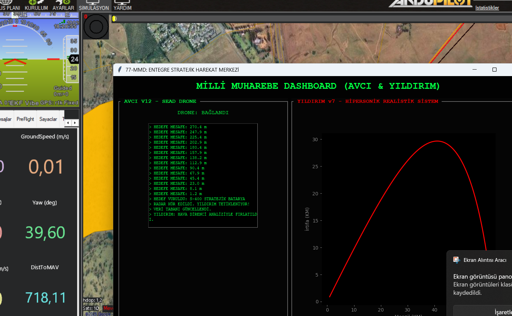

## 📸 Sistemden Görüntüler

*Şekil 1: YILDIRIM v8 Hipersonik Balistik Analiz Ekranı*

*Şekil 2: AVCI V12 Otonom Radar Atlatma Manevraları*
# 🚀 77-MMD: Milli Beka ve Stratejik Darbe Sistemi

**77-MMD (Milli Muharebe Dashboard)**; otonom bir SEAD drone'u olan **AVCI V12** ile hipersonik balistik füze sistemi **YILDIRIM v8**'in entegre harekat konseptini simüle eden bir komuta kontrol yazılımıdır.

## 🛡️ Harekat Safhaları

### 1. AVCI V12 - Otonom Sızma
* **Radar Atlatma:** Pasif radar sistemlerini körletmek amacıyla otonom **zikzak manevraları** icra eder.
* **Hedef Tespiti:** Stratejik bataryaları tespit ederek koordinat verilerini gerçek zamanlı olarak sisteme aktarır.

### 2. YILDIRIM v8 - Hipersonik Darbe
* **Stratejik Menzil:** 600 KM menzilli, Mach 7.7 hızında hipersonik analiz.
* **Realistik Fizik:** İrtifaya bağlı hava yoğunluğu ve atmosferik sürtünme hesaplamaları.
* **Zaman Senkronu:** 4-5 dakikalık gerçek zamanlı uçuş simülasyonu.

## 💻 Teknik Altyapı
* **Dil:** Python (Tkinter, Matplotlib)
* **Telemetri:** DroneKit
* **Veritabanı:** MySQL (Harekat loglama)
